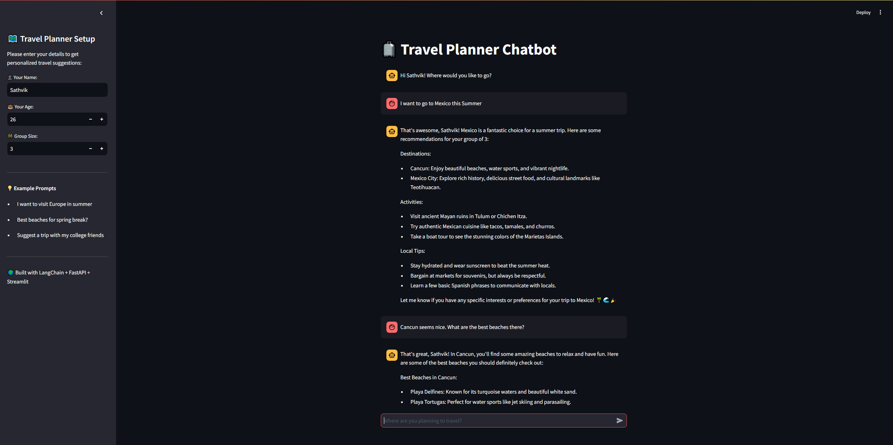

# 🧳 Travel Planner Chatbot

> Your AI-powered assistant for planning personalized and exciting travel adventures — built using LangChain, FastAPI, and Streamlit!

---

## ✨ Overview

The **Travel Planner Chatbot** is an interactive conversational assistant that helps users plan trips based on their preferences — destination, age, and group size. It responds with tailored recommendations for places to visit, food to try, activities, and more.

This project was developed as part of the **Basic Bot Assignment** and demonstrates both technical and UX polish to create a portfolio-grade chatbot experience.

---

## 🧠 Features

- 🎉 **Personalized Conversation**: Collects user's name, age, and group size to tailor responses.
- 🗺️ **Dynamic Destination Planning**: Suggests locations, activities, events, and restaurants.
- 🤖 **LLM Integration**: Powered by OpenAI's GPT via LangChain for natural conversation.
- 💬 **Memory Support**: Maintains chat history with LangChain's memory to improve flow.
- ❓ **Fallback Handling**: Gracefully handles off-topic inputs like code/math questions.
- ✅ **Conditional Logic**: Alters recommendations based on user demographics (e.g., age < 30).
- 💻 **Full-Stack Deployment**: Combines FastAPI backend with Streamlit frontend for full interactivity.

**Conversation Flow UML**

---

## 🧱 Tech Stack

| Layer        | Tool/Library       |
|--------------|--------------------|
| 🧠 LLM        | OpenAI GPT-3.5 via LangChain |
| 🖥️ Frontend  | Streamlit          |
| 🧩 Backend    | FastAPI            |
| 🔄 State Mgmt | LangChain Memory   |
| 📦 Packaging  | Pydantic, Uvicorn  |
| 📂 Deployment | Localhost (can be Dockerized) |

---

## 🚀 How to Run the App

### 🔧 Prerequisites

- Python 3.8+
- OpenAI API Key

### 📦 Install Dependencies

pip install -r requirements.txt

### Run Backend

uvicorn main:app --reload

### Run Frontend

streamlit run streamlit_app.py

### 👨‍💻 Author
Sathvik Vadavatha
🖥️ Master’s in Information Systems
✉️ [vadavatha.s@northeastern.edu]
